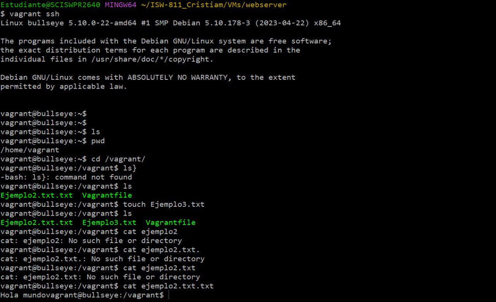
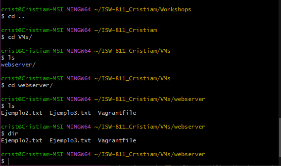

#WORKSHOP 01 - Vagrant

##Instalacion de VirtualBox
 VirtualBox es un hypervisor que vamos a utilizar para hospedar una maquina virutal con Debian.

[VirtualBox]( https://www.virtualbox.org/wiki/Downloads "Descarga de VirtualBox")

##Instalacion de Vagrant
Vagrant es una herramienta open-source que junto a virtualBox permite un uso sensillo y rapido desde una terminal.

[Vagrant]( https://developer.hashicorp.com/vagrant/downloads "Descarga de Vagrant")

##Aprovechamiento de la maquina creada Bulleye
Creamos una maquina debia como demostracion y creamos unas carpetas dentro de maquina virtual desde la terminal de git.

archivos creados
la terminal de bash de git no permite crear trees

